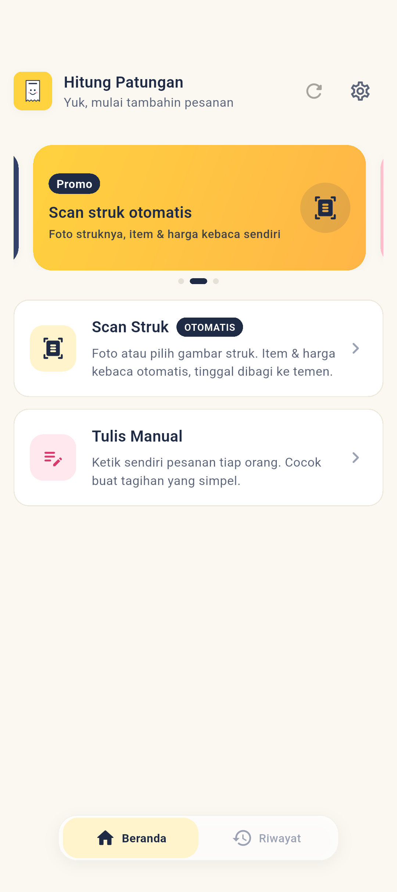
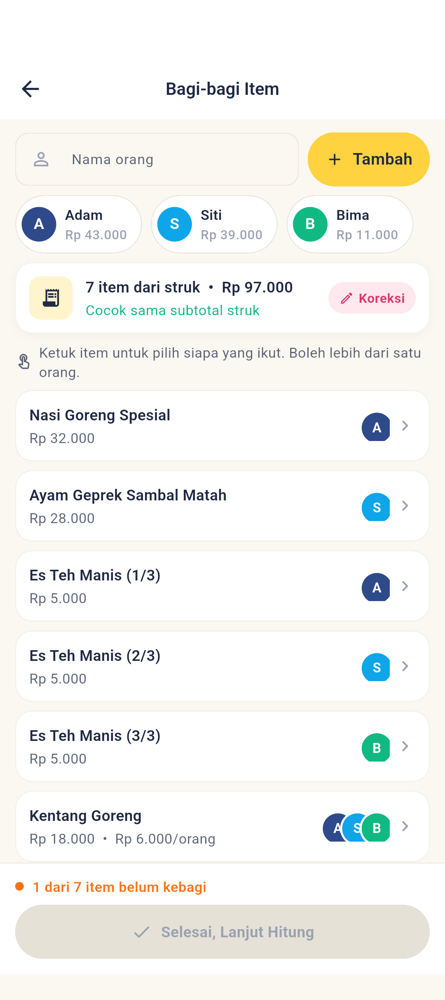
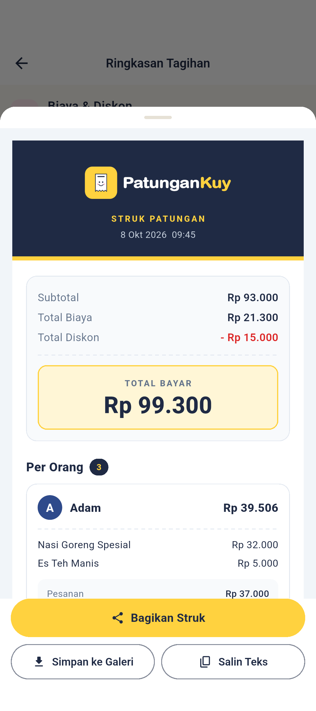
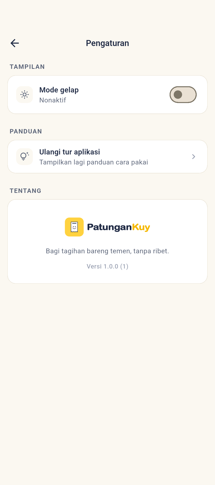

<div align="center">

<picture>
  <source media="(prefers-color-scheme: dark)" srcset="assets/branding/logo_horizontal.png" />
  
</picture>

**Split bill jadi gampang. Scan struk, bagi item, langsung share!**

Aplikasi patungan (split bill) untuk kamu dan teman-temanmu. Foto struknya, pilih siapa makan apa, dan PatunganKuy menghitung siapa bayar berapa, lengkap dengan pembagian pajak, ongkir, dan diskon secara proporsional.

[](https://github.com/alfaisaldwi/patungan_kuy/actions/workflows/build-apk.yml)
[](https://flutter.dev)
[](https://dart.dev)
[](https://bloclibrary.dev)
[](#%EF%B8%8F-arsitektur)
[](#)

</div>

---

## 📱 Screenshots

<!-- Simpan gambar di folder `screenshots/` dengan nama file di bawah ini -->

<div align="center">

| Beranda | Bagi-bagi Item | Hasil & Share | Pengaturan |
| :---: | :---: | :---: | :---: |
|  |  |  |  |

</div>

---

## ✨ Fitur

### 📷 Scan Struk (OCR On-Device)
- Ambil foto struk lewat **kamera** atau pilih dari **galeri**.
- Teks dikenali **on-device** dengan **Google ML Kit Text Recognition**, tanpa internet dan tanpa kirim data ke server.
- Parser yang memahami format struk Indonesia (GoFood, GrabFood, dll):
  - Deteksi item beserta harganya (`2x Ayam Geprek  Rp25.000`).
  - Deteksi otomatis **subtotal**, **ongkir/biaya layanan**, dan **diskon/voucher/promo**, termasuk harga bernilai minus.

### 🍽️ Bagi-bagi Item
- Semua item hasil scan tampil di satu daftar. **Ketuk item, lalu pilih siapa yang ikut**. Boleh lebih dari satu orang, harganya dibagi rata.
- Avatar berwarna menunjukkan siapa saja yang sudah memilih tiap item. Item yang belum kebagi ditandai jelas.
- **Pecah per porsi**: item seperti `3x Es Teh` bisa dipecah jadi 3 porsi untuk orang berbeda. Jumlah porsi terdeteksi otomatis dari nama item, dan total harganya tetap sama.
- **Koreksi hasil scan**: ubah, tambah, atau hapus item, plus pengecekan apakah total item sudah cocok dengan subtotal struk.
- Tombol lanjut baru aktif setelah semua item kebagi.

### 🧮 Kalkulator Split Bill
- Bisa **input manual** tanpa scan: tambah orang, item, dan harga per orang.
- Dukung **pajak/biaya layanan**, **ongkir**, dan **diskon** (nominal `Rp` atau persentase `%`).
- Biaya dan diskon dibagi **proporsional** sesuai besar pesanan tiap orang. Yang pesan lebih banyak, nanggung fee lebih besar. Adil! ⚖️

### 🧾 Bagikan Hasil
- Hasil dirender jadi **gambar struk panjang**: lebar seukuran layar HP, tinggi mengikuti isi, lengkap dengan logo dan rincian per orang.
- **Bagikan** langsung ke WhatsApp, Telegram, atau aplikasi lain.
- **Simpan ke galeri** dengan satu ketukan.
- **Salin teks ringkasan** yang siap tempel di grup chat (format tebal WhatsApp).

### 🕘 Riwayat Tagihan
- Setiap tagihan yang dihitung **tersimpan otomatis** secara lokal (Hive), tanpa akun dan tanpa internet.
- Lihat rincian lengkap per orang, atau **muat ulang** tagihan lama ke kalkulator.
- Geser untuk menghapus, atau bersihkan semua riwayat sekaligus.

### ↩️ Urungkan
- Salah hapus orang, item, pesanan, atau riwayat? Tinggal ketuk **Urungkan**, dan datanya kembali ke posisi semula.

### 🎨 Tampilan & Pengaturan
- Tema mengikuti warna brand: kuning, navy, dan pink, dengan **mode terang** (default) dan **mode gelap**.
- Halaman **Pengaturan**: switch mode gelap, ulangi tur aplikasi, dan info versi.
- **Splash screen** beranimasi dan **tur fitur** (showcase) untuk pengguna baru. Tur hanya tampil sekali, dan statusnya tersimpan offline.

---

## 🎯 Cara Pakai

1. **Scan** struk belanja atau pesananmu (atau input manual).
2. **Bagi** tiap item ke orang yang memesannya.
3. **Hitung**: pajak, ongkir, dan diskon dibagi otomatis secara proporsional.
4. **Share** gambar struk atau teks ringkasan ke grup chat. Selesai! 🎉

---

## 🏗️ Arsitektur

Proyek ini menerapkan **Clean Architecture** dengan pemisahan layer per fitur, **BLoC** untuk state management, dan **GetIt** untuk dependency injection.

```
lib/
├── main.dart                     # Entry point, splash, tema Material 3
├── injection_container.dart      # Dependency injection (GetIt)
├── core/
│   ├── theme/                    # Design system & pengatur tema
│   ├── onboarding/               # Tur fitur (showcase) + status SharedPreferences
│   ├── widgets/                  # Komponen bersama: AppDialog, AppToast
│   ├── utils/                    # Extension helper (mis. withOpacityValue)
│   └── error/                    # Failure classes (functional error handling)
└── features/
    ├── splash/                   # Splash screen animasi
    ├── home/                     # Bottom navigation (Beranda & Riwayat)
    ├── calculator/               # Split bill, ringkasan, gambar struk
    ├── scanner/                  # Scan struk (ML Kit + parser)
    ├── assignment/               # Bagi-bagi item ke orang
    ├── history/                  # Riwayat tagihan (Hive)
    └── settings/                 # Halaman pengaturan
```

**Prinsip yang dipakai:**
- **Domain layer** murni Dart, tidak bergantung pada Flutter.
- Error handling fungsional dengan `Either<Failure, T>` dari **dartz**.
- Entities immutable dengan **Equatable**.
- Alur data satu arah: `UI → Event → BLoC → UseCase → Repository → DataSource`.

---

## 🛠️ Tech Stack

| Kategori | Teknologi |
| --- | --- |
| Framework | [Flutter](https://flutter.dev) (Material 3) |
| State Management | [flutter_bloc](https://pub.dev/packages/flutter_bloc) |
| Dependency Injection | [get_it](https://pub.dev/packages/get_it) |
| Functional Programming | [dartz](https://pub.dev/packages/dartz) |
| OCR | [google_mlkit_text_recognition](https://pub.dev/packages/google_mlkit_text_recognition) |
| Ambil Gambar | [image_picker](https://pub.dev/packages/image_picker) |
| Share | [share_plus](https://pub.dev/packages/share_plus) |
| Simpan ke Galeri | [gal](https://pub.dev/packages/gal) |
| Database Lokal | [hive](https://pub.dev/packages/hive) |
| Preferensi | [shared_preferences](https://pub.dev/packages/shared_preferences) |
| Tur Fitur | [showcaseview](https://pub.dev/packages/showcaseview) |
| Navigasi Bawah | [persistent_bottom_nav_bar_v2](https://pub.dev/packages/persistent_bottom_nav_bar_v2) |
| Banner | [carousel_slider](https://pub.dev/packages/carousel_slider) |
| Info Versi | [package_info_plus](https://pub.dev/packages/package_info_plus) |
| Ikon & Splash | [flutter_launcher_icons](https://pub.dev/packages/flutter_launcher_icons), [flutter_native_splash](https://pub.dev/packages/flutter_native_splash) |

---

## 🚀 Menjalankan Proyek

### Prasyarat
- [Flutter SDK](https://docs.flutter.dev/get-started/install) 3.47 (Dart `^3.10`)
- Java 17
- Android Studio / Xcode (untuk emulator atau device fisik)

### Langkah

```bash
# Clone repository
git clone https://github.com/alfaisaldwi/patungan_kuy.git
cd patungan_kuy

# Install dependencies
flutter pub get

# Jalankan aplikasi
flutter run

# Jalankan test
flutter test
```

> **Catatan:** Scan struk memakai Google ML Kit yang berjalan on-device, jadi hanya tersedia di **Android** dan **iOS**.

### Build APK

```bash
flutter build apk --release
```

APK juga dibuat otomatis oleh GitHub Actions ([build-apk.yml](.github/workflows/build-apk.yml)) setiap push ke `main`/`dev` atau pull request ke `main`. Workflow menjalankan test dulu, lalu mengunggah **`patungan_kuy.apk`** sebagai artifact di halaman run. Workflow juga bisa dijalankan manual dari tab **Actions**.

> Build release saat ini masih ditandatangani dengan debug key, jadi APK dari run yang berbeda tidak bisa saling update. Uninstall versi lama sebelum memasang yang baru.

### Screenshot README

Screenshot di atas diambil otomatis dari aplikasi asli dengan data contoh. Jalankan emulator Android, lalu:

```bash
flutter drive \
  --driver=test_driver/integration_test.dart \
  --target=integration_test/screenshots_test.dart
```

Hasilnya tersimpan di folder `screenshots/`.

### Ikon & Splash

Sumber desain ada di `assets/images/` (SVG). PNG siap pakai ada di `assets/branding/`. Setelah mengganti gambar, generate ulang:

```bash
dart run flutter_launcher_icons
dart run flutter_native_splash:create
```

---

## 🤝 Kontribusi

Kontribusi selalu terbuka! Silakan:

1. Fork repository ini
2. Buat branch fitur (`git checkout -b fitur/nama-fitur`)
3. Commit perubahanmu (`git commit -m 'Menambahkan fitur X'`)
4. Push ke branch (`git push origin fitur/nama-fitur`)
5. Buka Pull Request

---

<div align="center">

**Patungan? Kuy! 🍜**

</div>
